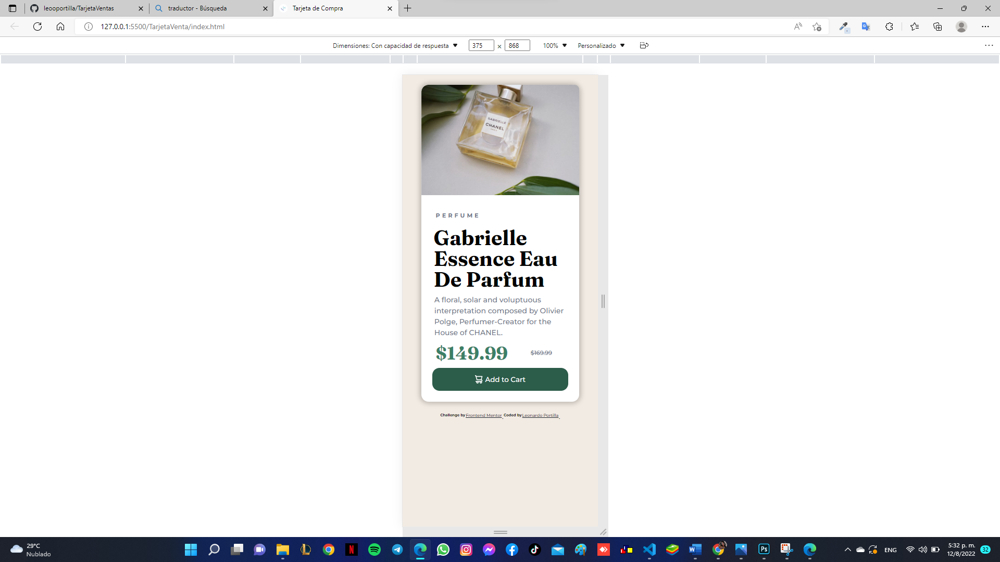

# Frontend Mentor - Product preview card component solution

### Screenshot

### Built with
- Semantic HTML5 markup
- CSS custom properties

### What I learned
En este desafio aprendi mucho mas sobre el manejo de la escala de EM y REM (Su significado), tambien entendi mucho mas sobre @Media, al comienzo es un poco enredado entender los tamaños

### Continued development
Quisiera poder comprender mas sobre el manejo de la escala en cada proyecto, para que al momento de cambiar el tamaño de pantalla no se dañe tanto la forma de la pagina

## Author
- Git Hud - [Leonardo Portilla](https://github.com/leooportilla)
- Frontend Mentor - [@leooportilla](https://www.frontendmentor.io/profile/leooportilla)
